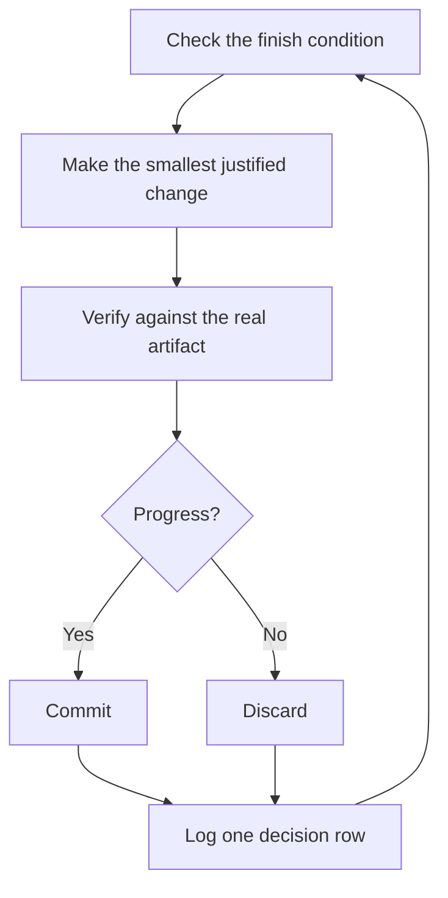

# Run work while you sleep

This is the payoff for everything before it. An agent you can trust to verify its own work is an agent you can leave alone with a hard task. What makes that safe isn't hope. It's a checkable finish condition, an isolated worktree, and a decision log you audit in the morning.

## Earn the trust before the loop

A loop you don't trust just produces unchecked work faster, and the mess compounds with every iteration. Before you leave one running, check that it has earned it:

- You've done the task once by hand, or watched an agent do it, so you know what good looks like.
- The agent has the tools and signals you'd use yourself: the verification skill, the profiler, the logs.
- Every stage proves its work and can stop the line when the work misses the bar.
- You've read a few transcripts and turned repeated failures into tools, skills, or checks.

Make the loop autonomous only after all four hold. Until then, run it while you watch.

## The overnight contract

A good handoff has the goal, the finish condition, permissions, and an escape hatch. It doesn't need to be long:

```text
/poteto-mode im going to bed. migrate every caller to the new parser in a fresh worktree off <base>.
done means zero old callers, all parser fixtures pass, old api deleted.
keep a decision log. don't ask me before committing.
Keep running until the finish predicate passes. if you're truly stuck after a few hours, stop and write up why.
```

Walk through what each line buys you:

- "im going to bed" asks the agent to continue within the agreed permissions. It does not override host safety rules or supply missing consent.
- "done means..." turns the goal into checks every iteration can run.
- "fresh worktree off `<base>`" keeps the run from colliding with anything else you have open.
- "don't ask me before committing" pre-answers the permission the agent would otherwise block on.
- Session automation and event watchers can provide a wake mechanism when the current host exposes them and you've authorized their use. They are host capabilities, not pstack skills. The [Autonomous run playbook](../../skills/poteto-mode/playbooks/autonomous-run.md) re-checks the finish condition using available mechanisms. Without a scheduler, work lasts only as long as the executing session can run; laptop closure and session restarts are not a persistence guarantee.
- The escape hatch lets it stop at a genuine dead end and write up why, which beats eight hours of creative goal reinterpretation.

Because you'll review this work after stepping away, `/poteto-mode` routes it through [`/figure-it-out`](../../skills/figure-it-out/SKILL.md), which designs the run's phases before any code and wires in the decision log.

To stop a run on purpose, ask it to pause safely before going offline or restarting Copilot. The [Pause safely playbook](../../skills/poteto-mode/playbooks/pause-safely.md) finishes or backs out of the current step, makes a permitted work-in-progress checkpoint, and writes a durable resume note. Session pickup reads that note. `/pstack resume` can inspect existing handoff facts without starting the task. Saying "keep going" never triggers a pause.

## What the loop does all night



One change, one check, one log row, every iteration. Changes that didn't help get discarded, not left to ride. A plateau means pivot, not stop, and the finish condition never quietly relaxes to declare victory.

## The morning audit

[`/show-me-your-work`](../../skills/show-me-your-work/SKILL.md) is what makes the run reviewable. Each row records the time, phase, decision, reason, an evidence pointer, and the result, in a TSV at `decisions.tsv` (or `.audit/<task-slug>.tsv` when several runs share a directory). It stays local by default. Commit it when the work is ambitious enough that a reviewer needs the trail to trust the result.

When you're back, ask for the run in review form:

```text
/show-me-your-work catch me up on what you did last night
```

Before the skill hands back its summary, it spawns a reviewer on a different model family to read the trail and the transcript, and the reply ends with an Attention section listing what deserves your scrutiny. Read that section first, then the log rows it points at. You're auditing decisions, not re-reading the whole night.

## When the night holds a queue, not a task

The contract above drives one task to one finish condition. Some nights hold more, a queue of independent changes or a whole program. Three playbooks scale the same trust up.

[Autopilot-full](../../skills/poteto-mode/playbooks/autopilot-full.md) runs a queue of independent PRs to merged. Each PR gets one owner agent that carries it from build through merge, and no owner merges on its own verdict. A swarm of fresh verifiers checks every merge-ready head, and only a clean verdict authorizes the merge:

```text
/poteto-mode full autopilot on this queue. each item is independent. i want them merged by morning.
```

[Autopilot-stack](../../skills/poteto-mode/playbooks/autopilot-stack.md) runs the same owner loop but ships nothing. You wake up to one linear base-branch stack with a verifier's verdict on every link, and you review and land it yourself. Pick it over Autopilot-full when the changes are coupled, or when you want your own eyes on the work before anything merges:

```text
/poteto-mode autopilot these five changes but stack them, don't ship. i'll land the stack in the morning.
```

[Orchestrate](../../skills/poteto-mode/playbooks/orchestrate.md) is for a program that outlives any single agent: multi-day, many stacked PRs, fleets of subagents under one standing coordinator chat. The coordinator authors briefs, collects what its subagents finish, keeps the lowest unmerged PR green, and never writes code itself. It's deliberately heavy machinery. If one agent could finish the work in a session, the playbook itself routes you back to the overnight contract above:

```text
/poteto-mode orchestrate the store migration. own it until every package is converted and merged. i'll check in twice a day.
```

## Coordinate several bodies of work

If the current Copilot host exposes persistent sessions, messaging, and isolated child workspaces, a standing coordinator can direct owners instead of writing their code. Otherwise use bounded Task agents and durable handoffs, or keep the program supervised. `/pstack capabilities` reports available, unavailable, and unknown host surfaces. Treat unknown as unavailable until the current host proves otherwise.

A few habits help:

- Give each feature, migration, perf push, or cleanup its own scoped session and isolated writing workspace.
- Link accessible prior sessions, decisions, and artifacts in the brief. Do not assume chats automatically become shared context.
- Independently verify each PR before merge, then let the appropriate execution playbook carry the queue.
- Ask for a plan backed by data, with empirical questions answered by prototypes.
- Confirm where work executes and what keeps it alive. Neither cloud execution nor continued work with your laptop closed is a plugin promise.

Before program execution, persist the agreed objective in the decision trail, including the plan path, PR order, verification rule, who may merge, and the done condition. On the operator's go, arm hourly audits through available approved session automation or a bounded in-session timer. Record any inability to wake a closed session.

At each audit, re-read the execution playbook and persisted objective, inspect actual lane progress and evidence, and correct drift within the approved scope. Log the audit even when nothing changed. Report only new tracked changes, blockers, or decisions that need the operator, not an unchanged status table.

One prompt can cover research and a gated plan:

```text
/poteto-mode refactor this repo so its architecture is more agent friendly. use /correct and /architect on past commits and review comments to find repeated mistakes. use /recall for available history. answer empirical questions with prototypes. come back with a plan backed by data. don't execute it until i approve the plan and choose autopilot-stack or autopilot-full.
```

## Start work on a schedule or event

If your host exposes scheduling or event triggers, an explicitly approved automation can start a bounded maintenance task. Triage, reproduction, fixing, and verification suit separate stages:

- Every stage can stop the line. Triage can find expected behavior, reproduction can fail, and the fixer can judge a change too risky. Each prevents bad work from reaching the next stage.
- Every stage hands over evidence. Reproduction records the broken state, and the fix records before-and-after proof. A human can check that the agent fixed the right thing before reading code.

pstack does not bundle an automation pack or supply the scheduling runtime. Agree on the repository, triggers, permissions, cost, evidence, and stop conditions before configuring a host automation. An expensive dynamic workflow requires explicit consent even when it is one stage of a larger program.

**Pitfall:** a duration is not a finish condition. "work on this for 4 hours" gives the agent nothing to check, and you'll wake up to four hours of motion instead of a result. Give the automation a predicate that can pass or fail.

Next: [Steer with principle names](./08-principles.md).
